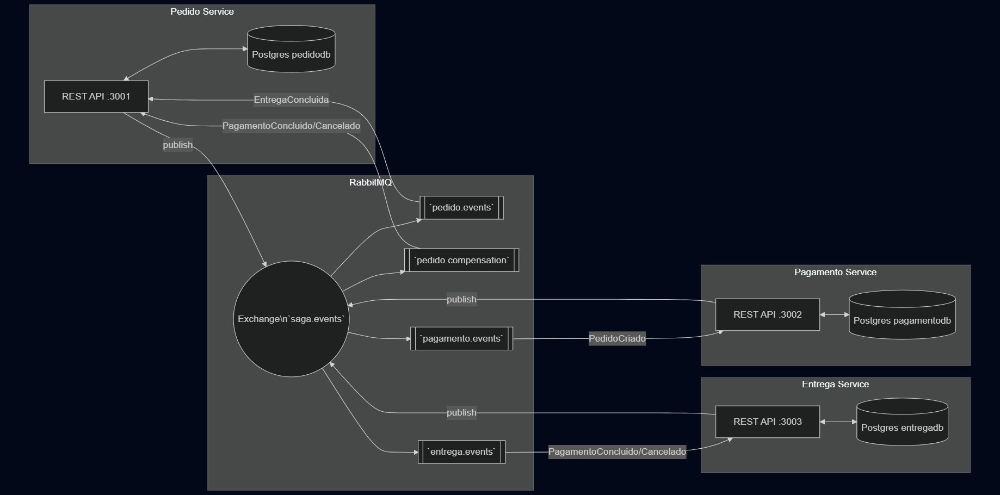

# Saga - Microserviços de Pedido, Pagamento e Entrega

Este projeto demonstra uma arquitetura de microserviços utilizando o padrão SAGA (coreografado) para orquestrar o ciclo de vida de um pedido: criação do pedido, processamento do pagamento e execução da entrega, com compensações em caso de falhas.


## **Descrição do Problema**
- **Cenário:** Em um sistema de delivery, a criação de um pedido dispara uma cadeia de operações distribuídas (pagamento e entrega). Cada serviço tem seu próprio banco de dados, e precisamos garantir consistência eventual e respostas resilientes a falhas.
- **Desafio:** Coordenar estados entre serviços independentes sem transações distribuídas (2PC), adotando comunicação assíncrona via eventos e compensações em caso de falhas.
- **Objetivo:** Implementar uma SAGA coreografada com RabbitMQ, onde cada serviço reage a eventos e executa ações (e compensações) para manter o sistema consistente.


## **Arquitetura da Solução**
- **Estilo:** Microserviços + SAGA coreografada (event-driven)
- **Mensageria:** RabbitMQ (`fanout` Exchange `saga.events`) com filas dedicadas por serviço
- **Persistência:** Um banco PostgreSQL por serviço (isolamento de dados)



## **Fluxo do SAGA (com Compensações)**
Padrão coreografado: não há um orquestrador central. Cada serviço reage a eventos do Exchange `saga.events` publicados pelos demais.

- Passo 1 — Criação do Pedido
  - Endpoint `POST /pedidos` (Pedido Service) cria registro com status `PENDENTE`.
  - Publica evento `PedidoCriado` em `saga.events`.

- Passo 2 — Processamento do Pagamento
  - Pagamento Service consome `PedidoCriado` na fila `pagamento.events` e cria um registro de pagamento `PENDENTE`.
  - Simula aprovação com 80% de sucesso; publica `PagamentoConcluido` ou `PagamentoCancelado`.

- Passo 3 — Entrega (sucesso ou compensação)
  - Entrega Service consome `PagamentoConcluido`/`PagamentoCancelado` em `entrega.events`.
    - Sucesso: cria entrega, atualiza para `ENVIADO`, publica `EntregaConcluida` com status `ENTREGUE`.
    - Falha (compensação): cria entrega de controle e atualiza para `CANCELADO`, publica `EntregaCancelada`.

- Passo 4 — Atualizações do Pedido
  - Pedido Service consome:
    - `PagamentoConcluido`/`PagamentoCancelado` em `pedido.compensation`:
      - Sucesso: atualiza pedido para `ENVIADO` (aguardando confirmação da entrega).
      - Falha: atualiza pedido para `CANCELADO` e publica `PedidoCancelado` (sinal de compensação).
    - `EntregaConcluida` em `pedido.events`: atualiza pedido para `ENTREGUE` (estado final).

Principais eventos no Exchange `saga.events`:
- `PedidoCriado`, `PedidoCancelado`
- `PagamentoConcluido`, `PagamentoCancelado`
- `EntregaConcluida`, `EntregaCancelada`

Filas dedicadas (todas ligadas ao Exchange `fanout`):
- Pedido Service: `pedido.events` e `pedido.compensation`
- Pagamento Service: `pagamento.events`
- Entrega Service: `entrega.events`


## Como executar o projeto

1. Clone o repositório:

   Você pode clonar o projeto de duas formas:
   * Via HTTPS:
     ```cmd
     git clone https://github.com/dev-corporativos/saga.git
     ```
   * Via SSH:
     ```cmd
     git clone git@github.com:dev-corporativos/saga.git
     ```
     
2. Acesse a pasta do projeto
   ```cmd
   cd saga
   ```
3. Certifique-se de ter Docker + Docker Compose instalados.

4. Rode o contêiner na sua máquina:
   ```cmd
   docker compose up
   ```

   *Caso deseje rodar em segundo plano, insira a tag `-d`*:
   ```cmd
   docker compose up -d
   ```


## Como acessar o endpoint:
1. Você pode testar usando:

   - Insomnia
   - Postman
   - Thunder Client

3. Criar um pedido

Use qualquer cliente HTTP para enviar:
- Método: `POST`
- URL: `http://localhost:3001/pedidos`
- Body (JSON):
```json
{
  "produto": "Notebook",
  "quantidade": 1,
  "valor": 4500
}
```
Resposta esperada (JSON):
```json
{
  "pedidoId": "<uuid>",
  "status": "PENDENTE",
  "message": "[Pedido Service] Pedido criado com sucesso."
}
```

4. Consultar pagamento e entrega

- Pagamento Service: `GET http://localhost:3002/pagamentos/<pedidoId>`
- Entrega Service: `GET http://localhost:3003/entregas/<pedidoId>`

5. Consultar pedidos

- Pedido Service: `GET http://localhost:3001/pedidos`

Coleções de exemplo (Postman): importe este JSON em Postman para ter os 3 requests prontos.

```json
{
  "info": {
    "name": "Saga Demo",
    "schema": "https://schema.getpostman.com/json/collection/v2.1.0/collection.json"
  },
  "item": [
    {
      "name": "Criar Pedido",
      "request": {
        "method": "POST",
        "header": [{ "key": "Content-Type", "value": "application/json" }],
        "url": { "raw": "http://localhost:3001/pedidos", "protocol": "http", "host": ["localhost"], "port": "3001", "path": ["pedidos"] },
        "body": { "mode": "raw", "raw": "{\n  \"produto\": \"Notebook\",\n  \"quantidade\": 1,\n  \"valor\": 4500\n}" }
      }
    },
    {
      "name": "Consultar Pagamento",
      "request": {
        "method": "GET",
        "url": { "raw": "http://localhost:3002/pagamentos/{{pedidoId}}", "protocol": "http", "host": ["localhost"], "port": "3002", "path": ["pagamentos", "{{pedidoId}}"] }
      }
    },
    {
      "name": "Consultar Entrega",
      "request": {
        "method": "GET",
        "url": { "raw": "http://localhost:3003/entregas/{{pedidoId}}", "protocol": "http", "host": ["localhost"], "port": "3003", "path": ["entregas", "{{pedidoId}}"] }
      }
    },
    {
      "name": "Listar Pedidos",
      "request": {
        "method": "GET",
        "url": { "raw": "http://localhost:3001/pedidos", "protocol": "http", "host": ["localhost"], "port": "3001", "path": ["pedidos"] }
      }
    }
  ],
  "variable": [
    { "key": "pedidoId", "value": "<preencha pelo retorno de Criar Pedido>" }
  ]
}
```


## **Tecnologias Utilizadas**
- **Linguagem/Runtime:** Node.js, TypeScript 
- **Framework Web:** Express 
- **Mensageria:** RabbitMQ (imagem `rabbitmq:3.12-management`), `amqplib`
- **Banco de Dados:** PostgreSQL 17 (um por serviço)
- **Containers:** Docker + Docker Compose

## Equipe de Desenvolvimento
| Nome | Matrícula |
| ----------------- | ----------- |
| [Robério Júnior](https://github.com/roberio-junior) | 20241038060010 |
| [Jardson Alan](https://github.com/jardsonalan) | 20241038060006 |
| [Ian Galvão](https://github.com/Barr0ca) | 20241038060011 |
| [José Lucas](https://github.com/uluscaz-ifrn) | 20241038060003 |
